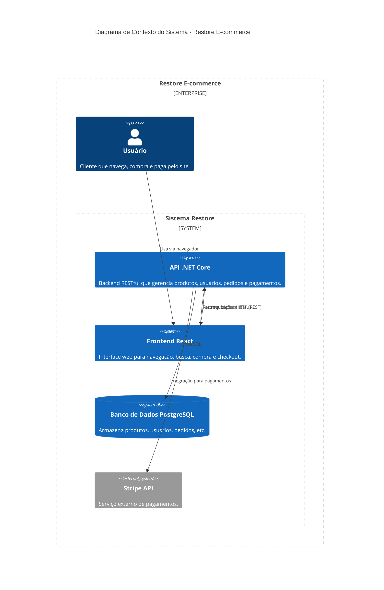

# Restore - Aplicação E-commerce

Uma aplicação completa de e-commerce, com backend em .NET Core e frontend em React + TypeScript.

---

## Diagrama C4 - Contexto do Sistema

O diagrama abaixo mostra a visão geral dos principais componentes e integrações do sistema Restore:



### Como funciona
- O **usuário** acessa o sistema pelo navegador, utilizando o frontend em React.
- O **frontend** se comunica com a **API .NET Core** via requisições HTTP (REST), enviando e recebendo dados de produtos, usuários, pedidos, etc.
- A **API** utiliza o **PostgreSQL** para armazenar e recuperar informações do sistema.
- Para pagamentos, a **API** integra com o serviço externo **Stripe**, processando transações de forma segura.

---

## Estrutura do Projeto

- `API/` - Backend .NET Core Web API
- `client/` - Frontend React + TypeScript

## Como rodar o projeto

### Backend
1. Acesse a pasta `API`
2. Copie o arquivo `appsettings.Development.template.json` para `appsettings.Development.json`
3. Preencha as configurações com seus dados reais:
   - String de conexão do banco
   - Chaves da API Stripe (disponíveis no [Painel Stripe](https://dashboard.stripe.com/apikeys))

```bash
cd API
cp appsettings.Development.template.json appsettings.Development.json
# Edite o appsettings.Development.json com seus dados
```

4. Execute a API:
```bash
dotnet run
```

### Frontend
1. Acesse a pasta `client`
2. Instale as dependências:
```bash
npm install
```
3. Inicie o servidor de desenvolvimento:
```bash
npm run dev
```

## Nota de Segurança
O arquivo `appsettings.Development.json` está no `.gitignore` e **não deve ser enviado ao GitHub**. Use sempre o arquivo template para criar sua configuração local.

---

## Funcionalidades
- Autenticação e autorização de usuários
- Catálogo de produtos com filtros e busca
- Carrinho de compras
- Integração com Stripe para pagamentos
- Gestão de pedidos
- Interface responsiva

## Tecnologias Utilizadas

### Backend
- .NET Core 8
- Entity Framework Core
- PostgreSQL
- Stripe API

### Frontend
- React 18
- TypeScript
- Material-UI
- Redux Toolkit
- React Router
- Stripe Elements 

