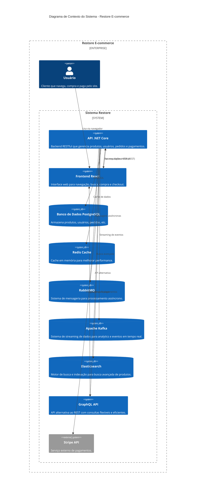

# Restore - Aplicação E-commerce

Uma aplicação completa de e-commerce, com backend em .NET Core e frontend em React + TypeScript.

---

## Diagrama C4 - Contexto do Sistema

O diagrama abaixo mostra a visão geral dos principais componentes e integrações do sistema Restore:



### Como funciona
- O **usuário** acessa o sistema pelo navegador, utilizando o frontend em React.
- O **frontend** se comunica com a **API .NET Core** via requisições HTTP (REST), enviando e recebendo dados de produtos, usuários, pedidos, etc.
- A **API** utiliza o **PostgreSQL** para armazenar e recuperar informações do sistema.
- O **Redis** é usado como cache em memória para melhorar a performance de consultas frequentes.
- O **RabbitMQ** processa mensagens de forma assíncrona (pedidos, emails, etc.).
- O **Apache Kafka** processa eventos em tempo real para analytics e comportamento do usuário.
- O **Elasticsearch** fornece busca avançada e indexação de produtos com recursos de full-text search.
- O **GraphQL** oferece uma API alternativa ao REST com consultas flexíveis e eficientes.
- Para pagamentos, a **API** integra com o serviço externo **Stripe**, processando transações de forma segura.

---

## Estrutura do Projeto

- `API/` - Backend .NET Core Web API
- `client/` - Frontend React + TypeScript

## Como rodar o projeto

### Pré-requisitos
- Docker instalado (para PostgreSQL, Redis e RabbitMQ)
- .NET 9.0 SDK
- Node.js 18+

### Backend
1. **Inicie os serviços com Docker:**
```bash
docker-compose up -d
```

2. Acesse a pasta `API`
3. Copie o arquivo `appsettings.Development.template.json` para `appsettings.Development.json`
4. Preencha as configurações com seus dados reais:
   - String de conexão do banco
   - String de conexão do Redis (já configurada no template)
   - Configurações do RabbitMQ (já configuradas no template)
   - Chaves da API Stripe (disponíveis no [Painel Stripe](https://dashboard.stripe.com/apikeys))

```bash
cd API
cp appsettings.Development.template.json appsettings.Development.json
# Edite o appsettings.Development.json com seus dados
```

5. Execute a API:
```bash
dotnet run
```

### Frontend
1. Acesse a pasta `client`
2. Instale as dependências:
```bash
npm install
```
3. Inicie o servidor de desenvolvimento:
```bash
npm run dev
```

## Nota de Segurança
O arquivo `appsettings.Development.json` está no `.gitignore` e **não deve ser enviado ao GitHub**. Use sempre o arquivo template para criar sua configuração local.

---

## Funcionalidades
- Autenticação e autorização de usuários
- Catálogo de produtos com filtros e busca
- Carrinho de compras
- Integração com Stripe para pagamentos
- Gestão de pedidos
- Interface responsiva
- **Cache Redis** para melhorar performance
- **Mensageria RabbitMQ** para processamento assíncrono
- **Streaming Kafka** para analytics em tempo real
- **Busca Elasticsearch** para busca avançada de produtos
- **API GraphQL** para consultas flexíveis e eficientes

## Tecnologias Utilizadas

### Backend
- .NET Core 9
- Entity Framework Core
- PostgreSQL
- Redis (Cache)
- RabbitMQ (Mensageria)
- Apache Kafka (Streaming)
- Elasticsearch (Busca)
- GraphQL (API alternativa)
- Stripe API

### Frontend
- React 18
- TypeScript
- Material-UI
- Redux Toolkit
- React Router
- Stripe Elements 

---

## Redis Cache

O projeto utiliza **Redis** como sistema de cache para melhorar a performance da aplicação.

### O que é Redis?
Redis é uma **"memória super rápida"** que armazena dados frequentemente acessados, reduzindo o tempo de resposta e a carga no banco de dados.

### Como funciona no projeto:
- **Cache de produtos**: Listas de produtos ficam em cache por 10 minutos
- **Cache de produto individual**: Produtos específicos ficam em cache por 30 minutos  
- **Cache de filtros**: Marcas e tipos ficam em cache por 1 hora
- **Invalidação automática**: Cache é limpo quando produtos são criados/atualizados/deletados

### Benefícios:
- ⚡ **Performance**: Produtos carregam muito mais rápido
- 📊 **Escalabilidade**: Menos consultas ao banco de dados
- 🎯 **Experiência do usuário**: Menos tempo de espera
- 🔄 **Flexibilidade**: Cache automático com expiração

### Exemplo prático:
```csharp
// Primeira busca: vai no banco (lento)
var products = await _context.Products.ToListAsync(); // 2-3 segundos

// Segunda busca: vai no Redis (rápido)
var cachedProducts = await _cacheService.GetAsync("products"); // 0.001 segundos
```

### Configuração:
O Redis já está configurado no `docker-compose.yml` e será iniciado automaticamente com:
```bash
docker-compose up -d
```

---

## RabbitMQ (Mensageria)

O projeto utiliza **RabbitMQ** como sistema de mensageria para processamento assíncrono de tarefas.

### O que é RabbitMQ?
RabbitMQ é um **"carteiro inteligente"** que entrega mensagens entre diferentes partes do sistema. Permite processar tarefas em background sem afetar a performance da aplicação.

### Como funciona no projeto:
- **Pedidos**: Quando um pedido é criado, uma mensagem é enviada para processamento assíncrono
- **Emails**: Confirmações de pedido são enviadas em background
- **Estoque**: Atualizações de estoque são processadas sem bloquear a aplicação
- **Faturas**: Geração de faturas acontece em background

### Benefícios:
- ⚡ **Performance**: Aplicação não fica bloqueada esperando processamento
- 📊 **Escalabilidade**: Pode processar milhares de mensagens por segundo
- 🔄 **Confiabilidade**: Mensagens não se perdem, mesmo se o sistema cair
- 🎯 **Desacoplamento**: Sistemas funcionam independentemente

### Exemplo prático:
```csharp
// Quando um pedido é criado
var message = new OrderCreatedMessage
{
    OrderId = order.Id,
    CustomerEmail = user.Email,
    TotalAmount = order.Total,
    CreatedAt = DateTime.UtcNow
};

// Envia para processamento assíncrono
await _messageService.PublishMessageAsync(message);
```

### Configuração:
O RabbitMQ já está configurado no `docker-compose.yml` e será iniciado automaticamente com:
```bash
docker-compose up -d
```

### Interface de Monitoramento:
- **URL**: http://localhost:15672
- **Usuário**: guest
- **Senha**: {sua_senha}

---

## Apache Kafka (Streaming de Dados)

O projeto utiliza **Apache Kafka** como sistema de streaming de dados para processamento de eventos em tempo real.

### O que é Apache Kafka?
Kafka é um **"rio de dados em tempo real"** que processa milhões de eventos por segundo. Diferente do RabbitMQ (que é como um correio), o Kafka é como um stream contínuo de dados onde você pode "pescar" as informações que precisa.

### Como funciona no projeto:
- **Eventos de Usuário**: Rastreia comportamento do usuário (cliques, navegação, buscas)
- **Eventos de Pedido**: Monitora criação e atualização de pedidos
- **Eventos de Busca**: Analisa termos de busca e resultados
- **Analytics em Tempo Real**: Processa dados para dashboards e relatórios

### Benefícios:
- ⚡ **Performance Extrema**: Processa milhões de eventos por segundo
- 📊 **Retenção de Dados**: Mantém eventos por dias/semanas
- 🔄 **Escalabilidade**: Fácil expansão horizontal
- 🎯 **Resistência a Falhas**: Dados replicados automaticamente
- 📈 **Analytics Avançados**: Análise de comportamento em tempo real

### Exemplo prático:
```csharp
// Evento de comportamento do usuário
var userEvent = new UserEvent
{
    UserId = "user-123",
    EventType = "product_view",
    ProductId = "boot-redis1",
    PageUrl = "/products/boot-redis1",
    Timestamp = DateTime.UtcNow
};

// Envia para processamento em tempo real
await _kafkaService.PublishUserEventAsync(userEvent);
```

### Configuração:
O Kafka já está configurado no `docker-compose.yml` e será iniciado automaticamente com:
```bash
docker-compose up -d
```

### Interface de Monitoramento:
- **URL**: http://localhost:8081
- **Acesso**: Direto (sem autenticação)

### Tópicos Kafka:
- **user-events**: Eventos de comportamento do usuário
- **order-events**: Eventos relacionados a pedidos
- **search-events**: Eventos de busca e navegação

### Consumidores:
- **UserEventsConsumer**: Processa eventos de usuário
- **OrderEventsConsumer**: Processa eventos de pedido
- **SearchEventsConsumer**: Processa eventos de busca

### Endpoint de Demonstração:
```bash
POST http://localhost:5000/api/orders/kafka-demo
```
Gera eventos únicos para teste do sistema Kafka.

---

## GraphQL (API de Consulta)

O projeto utiliza **GraphQL** como uma API alternativa ao REST, oferecendo consultas flexíveis e eficientes.

### O que é GraphQL?
GraphQL é um **"menu à la carte"** para APIs - permite que o cliente especifique exatamente quais dados quer receber. Diferente do REST (que é como um cardápio fixo), o GraphQL permite que você monte sua refeição ideal.

### Como funciona no projeto:
- **Endpoint Único**: Todas as consultas vão para `/graphql`
- **Consultas Flexíveis**: Cliente escolhe exatamente quais campos quer
- **Paginação Inteligente**: Sistema de cursor-based pagination
- **Filtros e Ordenação**: Consultas complexas em uma única requisição
- **Tipagem Forte**: Schema define exatamente o que pode ser consultado

### Benefícios:
- ⚡ **Performance**: Menos over-fetching e under-fetching
- 🎯 **Flexibilidade**: Cliente define exatamente o que precisa
- 📊 **Eficiência**: Uma requisição para dados complexos
- 🔍 **Documentação Automática**: Schema é a documentação
- 🎨 **Experiência do Desenvolvedor**: IntelliSense e validação

### Exemplo prático:
```graphql
# Consulta REST tradicional (múltiplas requisições)
GET /api/products          # Lista produtos
GET /api/products/1        # Detalhes do produto
GET /api/products/1/orders # Pedidos do produto

# Consulta GraphQL (uma única requisição)
query {
  product(id: 1) {
    id
    name
    price
    brand
    orders {
      id
      total
      orderDate
    }
  }
}
```

### Configuração:
O GraphQL já está configurado e disponível em:
```bash
# Endpoint GraphQL
http://localhost:5000/graphql

# Playground GraphQL (IDE)
http://localhost:5000/graphql/
```

### Queries Disponíveis:

#### Produtos:
```graphql
# Listar produtos com paginação
query {
  products {
    nodes {
      id
      name
      price
      brand
      type
    }
    pageInfo {
      hasNextPage
      hasPreviousPage
    }
  }
}

# Contar produtos
query {
  productCount
}

# Buscar produto específico
query {
  product(id: 1) {
    id
    name
    price
    brand
    description
  }
}
```

#### Usuários:
```graphql
# Listar usuários
query {
  users {
    nodes {
      id
      userName
      email
    }
  }
}

# Buscar usuário específico
query {
  user(id: "user-id") {
    id
    userName
    email
  }
}
```

#### Pedidos:
```graphql
# Listar pedidos
query {
  orders {
    nodes {
      id
      buyerEmail
      orderDate
      orderStatus
      total
    }
  }
}

# Buscar pedido específico
query {
  order(id: 1) {
    id
    buyerEmail
    orderDate
    orderStatus
    total
    orderItems {
      id
      price
      quantity
      itemOrdered {
        name
        pictureUrl
      }
    }
  }
}
```

### Mutations Disponíveis:

#### Produtos:
```graphql
# Criar produto
mutation {
  createProduct(input: {
    name: "Novo Produto"
    description: "Descrição do produto"
    price: 1000
    type: "Boot"
    brand: "Angular"
    quantityInStock: 10
  }) {
    id
    name
    price
  }
}

# Atualizar produto
mutation {
  updateProduct(id: 1, input: {
    name: "Produto Atualizado"
    price: 1500
  }) {
    id
    name
    price
  }
}

# Deletar produto
mutation {
  deleteProduct(id: 1)
}
```

#### Pedidos:
```graphql
# Criar pedido
mutation {
  createOrder(input: {
    shippingAddress: {
      name: "João Silva"
      line1: "Rua das Flores, 123"
      city: "São Paulo"
      state: "SP"
      postalCode: "01234-567"
      country: "Brasil"
    }
    paymentSummary: {
      last4: "1234"
      brand: "visa"
      expMonth: 12
      expYear: 2025
    }
  }) {
    id
    buyerEmail
    total
  }
}

# Atualizar status do pedido
mutation {
  updateOrderStatus(id: 1, status: SHIPPED)
}
```

### Recursos Avançados:
- **Filtros**: `where: { brand: { eq: "Angular" } }`
- **Ordenação**: `order: { price: ASC }`
- **Paginação**: `first: 10, after: "cursor"`
- **Projeções**: Escolha exatamente quais campos quer
- **Fragments**: Reutilize partes de queries
- **Variables**: Use variáveis para queries dinâmicas

### Interface de Desenvolvimento:
- **GraphQL Playground**: http://localhost:5000/graphql/
- **Schema Explorer**: Navegue pelo schema automaticamente
- **Query Builder**: Construa queries visualmente
- **Documentation**: Documentação automática do schema

---

## Elasticsearch (Busca Avançada)

O projeto utiliza **Elasticsearch** como motor de busca para fornecer busca avançada e indexação de produtos.

### O que é Elasticsearch?
Elasticsearch é um **"Google para seus dados"** - um motor de busca distribuído que permite buscar informações de forma rápida e inteligente. Diferente de uma busca simples no banco, o Elasticsearch entende sinônimos, erros de digitação e fornece resultados relevantes.

### Como funciona no projeto:
- **Indexação de Produtos**: Todos os produtos são indexados automaticamente
- **Busca Full-Text**: Busca por nome, descrição, marca e tipo
- **Busca Fuzzy**: Encontra resultados mesmo com erros de digitação
- **Filtros Avançados**: Por preço, marca, tipo, etc.
- **Ordenação Inteligente**: Por relevância, preço, nome, etc.
- **Paginação**: Resultados paginados para melhor performance

### Benefícios:
- ⚡ **Performance**: Busca em milissegundos mesmo com milhares de produtos
- 🎯 **Relevância**: Resultados mais precisos e relevantes
- 🔍 **Flexibilidade**: Busca por texto parcial, sinônimos, etc.
- 📊 **Analytics**: Análise de termos de busca mais populares
- 🎨 **Experiência do Usuário**: Busca instantânea e sugestões

### Exemplo prático:
```csharp
// Busca avançada com filtros
var searchRequest = new SearchRequestDto
{
    Query = "boot angular",
    Page = 1,
    PageSize = 10,
    SortBy = "price",
    SortOrder = "asc",
    MinPrice = 100,
    MaxPrice = 200,
    Brand = "Angular"
};

// Resultado com produtos relevantes
var result = await _elasticsearchService.SearchProductsAsync(searchRequest);
```

### Configuração:
O Elasticsearch já está configurado no `docker-compose.yml` e será iniciado automaticamente com:
```bash
docker-compose up -d
```

### Interface de Monitoramento:
- **Elasticsearch**: http://localhost:9200
- **Kibana**: http://localhost:5601

### Endpoints da API:
- **Health Check**: `GET /api/elasticsearch/health`
- **Busca**: `POST /api/elasticsearch/search`
- **Indexar Todos**: `POST /api/elasticsearch/index-all-products`
- **Sincronizar Produto**: `POST /api/elasticsearch/sync-product/{id}`
- **Remover Produto**: `DELETE /api/elasticsearch/remove-product/{id}`

### Funcionalidades de Busca:
- **Busca por Texto**: "boot", "angular", "red"
- **Busca Fuzzy**: "anglar" encontra "angular"
- **Filtros**: Por preço, marca, tipo
- **Ordenação**: Por nome, preço, marca, tipo
- **Paginação**: Resultados paginados

### Frontend:
- **Rota**: `/elasticsearch-search`
- **Interface**: Busca avançada com filtros em tempo real
- **Resultados**: Exibição paginada com ordenação

---

## 🐳 Docker e Serviços

### Estrutura de Containers
Todos os serviços estão agrupados na rede `restore-tools-network`:

- **restore-tools-postgres**: Banco de dados PostgreSQL
- **restore-tools-redis**: Cache Redis
- **restore-tools-rabbitmq**: Sistema de mensageria RabbitMQ
- **kafka**: Sistema de streaming Apache Kafka
- **zookeeper**: Coordenador do Kafka
- **kafka-ui**: Interface de monitoramento do Kafka
- **elasticsearch**: Motor de busca Elasticsearch
- **kibana**: Interface de monitoramento do Elasticsearch

### Comandos Docker Úteis

#### Iniciar todos os serviços:
```bash
docker-compose up -d
```

#### Verificar status:
```bash
docker-compose ps
```

#### Ver logs:
```bash
# Todos os serviços
docker-compose logs

# Serviço específico
docker-compose logs restore-tools-postgres
docker-compose logs restore-tools-redis
docker-compose logs restore-tools-rabbitmq
docker-compose logs kafka
docker-compose logs zookeeper
docker-compose logs elasticsearch
docker-compose logs kibana
```

#### Parar todos os serviços:
```bash
docker-compose down
```

#### Acessar containers:
```bash
# PostgreSQL
docker exec -it restore-postgres psql -U postgres -d restore

# Redis
docker exec -it restore-redis redis-cli -a {sua_senha}

# RabbitMQ (bash)
docker exec -it restore-rabbitmq bash
```

#### Testar serviços:
```bash
# Testar PostgreSQL
docker exec -it restore-postgres psql -U postgres -d restore -c "SELECT version();"

# Testar Redis
docker exec -it restore-redis redis-cli -a {sua_senha} PING

# Testar RabbitMQ
# Acesse http://localhost:15672 e faça login com guest/guest

# Testar Elasticsearch
curl http://localhost:9200

# Testar Kibana
# Acesse http://localhost:5601

### Configurações dos Serviços

| Serviço | Porta | Usuário | Senha | Interface |
|---------|-------|---------|-------|-----------|
| PostgreSQL | 5432 | postgres | {sua_senha} | - |
| Redis | 6379 | - | {sua_senha} | - |
| RabbitMQ | 5672/15672 | guest | {sua_senha} | http://localhost:15672 |
| Kafka | 9092 | - | - | - |
| Kafka UI | 8081 | - | - | http://localhost:8081 |
| Elasticsearch | 9200 | - | - | - |
| Kibana | 5601 | - | - | http://localhost:5601 |

### Volumes e Persistência
- **restore_tools_postgres_data**: Dados do PostgreSQL
- **restore_tools_redis_data**: Dados do Redis
- **restore_tools_rabbitmq_data**: Dados do RabbitMQ
- **kafka-data**: Dados do Kafka
- **zookeeper-data**: Dados do Zookeeper
- **zookeeper-logs**: Logs do Zookeeper
- **elasticsearch_data**: Dados do Elasticsearch

### Rede Docker
Todos os containers estão na rede `restore-tools-network`, permitindo comunicação interna entre os serviços.

