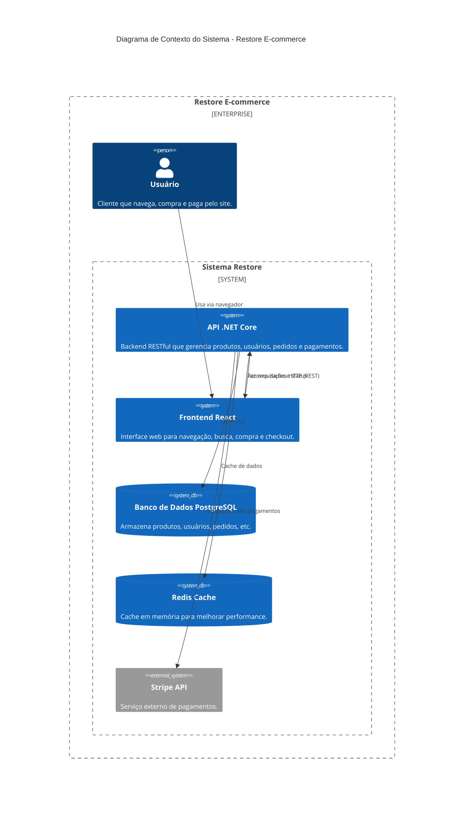

# Restore - Aplicação E-commerce

Uma aplicação completa de e-commerce, com backend em .NET Core e frontend em React + TypeScript.

---

## Diagrama C4 - Contexto do Sistema

O diagrama abaixo mostra a visão geral dos principais componentes e integrações do sistema Restore:



### Como funciona
- O **usuário** acessa o sistema pelo navegador, utilizando o frontend em React.
- O **frontend** se comunica com a **API .NET Core** via requisições HTTP (REST), enviando e recebendo dados de produtos, usuários, pedidos, etc.
- A **API** utiliza o **PostgreSQL** para armazenar e recuperar informações do sistema.
- O **Redis** é usado como cache em memória para melhorar a performance de consultas frequentes.
- Para pagamentos, a **API** integra com o serviço externo **Stripe**, processando transações de forma segura.

---

## Estrutura do Projeto

- `API/` - Backend .NET Core Web API
- `client/` - Frontend React + TypeScript

## Como rodar o projeto

### Pré-requisitos
- Docker instalado (para PostgreSQL e Redis)
- .NET 9.0 SDK
- Node.js 18+

### Backend
1. **Inicie os serviços com Docker:**
```bash
docker-compose up -d
```

2. Acesse a pasta `API`
3. Copie o arquivo `appsettings.Development.template.json` para `appsettings.Development.json`
4. Preencha as configurações com seus dados reais:
   - String de conexão do banco
   - String de conexão do Redis (já configurada no template)
   - Chaves da API Stripe (disponíveis no [Painel Stripe](https://dashboard.stripe.com/apikeys))

```bash
cd API
cp appsettings.Development.template.json appsettings.Development.json
# Edite o appsettings.Development.json com seus dados
```

5. Execute a API:
```bash
dotnet run
```

### Frontend
1. Acesse a pasta `client`
2. Instale as dependências:
```bash
npm install
```
3. Inicie o servidor de desenvolvimento:
```bash
npm run dev
```

## Nota de Segurança
O arquivo `appsettings.Development.json` está no `.gitignore` e **não deve ser enviado ao GitHub**. Use sempre o arquivo template para criar sua configuração local.

---

## Funcionalidades
- Autenticação e autorização de usuários
- Catálogo de produtos com filtros e busca
- Carrinho de compras
- Integração com Stripe para pagamentos
- Gestão de pedidos
- Interface responsiva
- **Cache Redis** para melhorar performance

## Tecnologias Utilizadas

### Backend
- .NET Core 8
- Entity Framework Core
- PostgreSQL
- Redis (Cache)
- Stripe API

### Frontend
- React 18
- TypeScript
- Material-UI
- Redux Toolkit
- React Router
- Stripe Elements 

---

## Redis Cache

O projeto utiliza **Redis** como sistema de cache para melhorar a performance da aplicação.

### O que é Redis?
Redis é uma **"memória super rápida"** que armazena dados frequentemente acessados, reduzindo o tempo de resposta e a carga no banco de dados.

### Como funciona no projeto:
- **Cache de produtos**: Listas de produtos ficam em cache por 10 minutos
- **Cache de produto individual**: Produtos específicos ficam em cache por 30 minutos  
- **Cache de filtros**: Marcas e tipos ficam em cache por 1 hora
- **Invalidação automática**: Cache é limpo quando produtos são criados/atualizados/deletados

### Benefícios:
- ⚡ **Performance**: Produtos carregam muito mais rápido
- 📊 **Escalabilidade**: Menos consultas ao banco de dados
- 🎯 **Experiência do usuário**: Menos tempo de espera
- 🔄 **Flexibilidade**: Cache automático com expiração

### Exemplo prático:
```csharp
// Primeira busca: vai no banco (lento)
var products = await _context.Products.ToListAsync(); // 2-3 segundos

// Segunda busca: vai no Redis (rápido)
var cachedProducts = await _cacheService.GetAsync("products"); // 0.001 segundos
```

### Configuração:
O Redis já está configurado no `docker-compose.yml` e será iniciado automaticamente com:
```bash
docker-compose up -d
```

